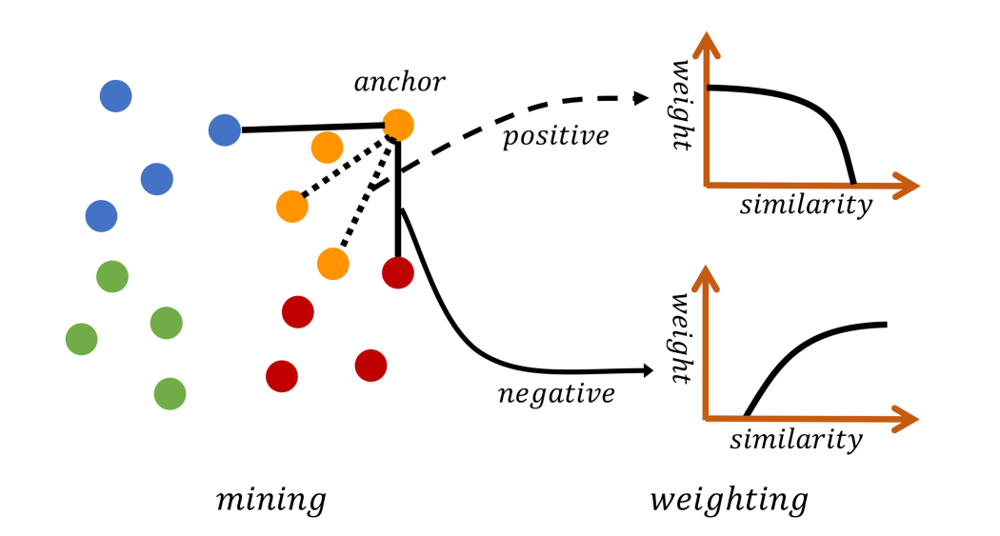

[](https://creativecommons.org/licenses/by-nc/4.0/)


# Multi-Similarity Loss for Deep Metric Learning (MS-Loss)

Code for the CVPR 2019 paper [Multi-Similarity Loss with General Pair Weighting for Deep Metric Learning](http://openaccess.thecvf.com/content_CVPR_2019/papers/Wang_Multi-Similarity_Loss_With_General_Pair_Weighting_for_Deep_Metric_Learning_CVPR_2019_paper.pdf)

 

### Performance compared with SOTA methods on CUB-200-2011

|Rank@K | 1 | 2 | 4 | 8 | 16 | 32 |
 |:---  |:-:|:-:|:-:|:-:|:-: |:-: |
|Clustering<sup>64</sup> | 48.2 | 61.4 | 71.8 | 81.9 | - | - |
|ProxyNCA<sup>64</sup> | 49.2 | 61.9 | 67.9 | 72.4 | - | - |
|Smart Mining<sup>64</sup> | 49.8 | 62.3 | 74.1 | 83.3 | - |
|Our MS-Loss<sup>64</sup>| **57.4** |**69.8** |**80.0** |**87.8** |93.2 |96.4|
|HTL<sup>512</sup> | 57.1| 68.8| 78.7| 86.5| 92.5| 95.5 | 
|ABIER<sup>512</sup> |57.5 |68.7 |78.3 |86.2 |91.9 |95.5 |
|Our MS-Loss<sup>512</sup>|**65.7** |**77.0** |**86.3**|**91.2** |**95.0** |**97.3**| 


### Prepare the data and the pretrained model 

The following script will prepare the [CUB](http://www.vision.caltech.edu.s3-us-west-2.amazonaws.com/visipedia-data/CUB-200-2011/CUB_200_2011.tgz) dataset for training by downloading to the ./resource/datasets/ folder; which will then build the data list (train.txt test.txt):

```bash
./scripts/prepare_cub.sh
```

Download the imagenet pretrained model of 
[bninception](http://data.lip6.fr/cadene/pretrainedmodels/bn_inception-52deb4733.pth) and put it in the folder:  ~/.torch/models/.


### Installation

```bash
pip install -r requirements.txt
python setup.py develop build
```
###  Train and Test on CUB200-2011 with MS-Loss

```bash
./scripts/run_cub.sh
```
Trained models will be saved in the ./output/ folder if using the default config.

Best recall@1 higher than 66 (65.7 in the paper).

### Contact

For any questions, please feel free to reach 
```
github@malongtech.com
```

### Citation

If you use this method or this code in your research, please cite as:

    @inproceedings{wang2019multi,
    title={Multi-Similarity Loss with General Pair Weighting for Deep Metric Learning},
    author={Wang, Xun and Han, Xintong and Huang, Weilin and Dong, Dengke and Scott, Matthew R},
    booktitle={Proceedings of the IEEE Conference on Computer Vision and Pattern Recognition},
    pages={5022--5030},
    year={2019}
    }

## License

MS-Loss is CC-BY-NC 4.0 licensed, as found in the [LICENSE](LICENSE) file. It is released for academic research / non-commercial use only. If you wish to use for commercial purposes, please contact sales@malongtech.com.

